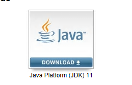
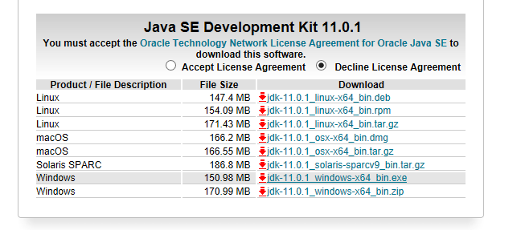
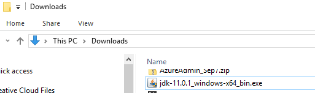
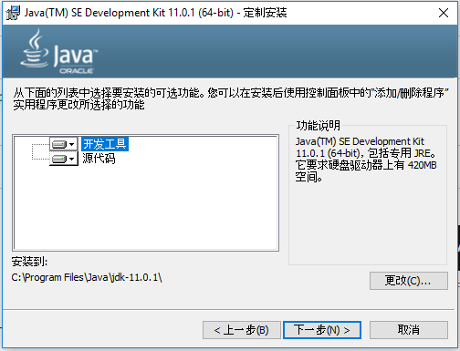

## 搭建Java开发环境-下载Java

### 下载Java
1. 从Oracle官网下载Java Development Kit (JDK)，打开网址[http://www.oracle.com/technetwork/java/javase/downloads/index.html](http://www.oracle.com/technetwork/java/javase/downloads/index.html "download JDK")
2. 在页面最上方，点击图标：  

3. 在Java SE Development Kit 11.0.1中，选中Accept License Agreement，点击下载Windows平台上运行的exe文件。  
   
**NOTE**: 如果没有选中接受许可协议，网站回提示你必须接受许可协议。
4. 双击下载的exe安装包：  

5. 接受所有默认选项，点击next直到安装完成。  

