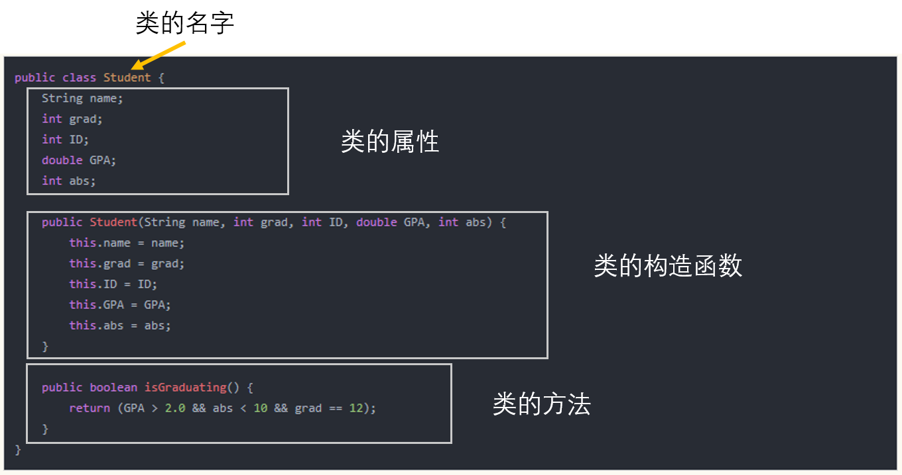

## 十：Java中的类

### 客户类 vs 对象类
Java中有2种**类**：客户类和对象类。在我们创建第一个*Hello World!* Java程序的时候，我们就已经使用过Java类了，这个类是一个客户类，它的*main()*方法是作为程序的入口的。
```java
public class Main {

    public static void main(String[] args) {
        System.out.println("Hello World!");
    }
}
```
在客户类中，我们主要来定义变量，定义其他**对象类**的对象，通过调用对象的方法来实现一定的业务逻辑。
```java
public class Main {

    public static void main(String[] args) {

        System.out.println("Hello, Client Class!");
        Student ada = new Student("Ada Lovelace", 2017, 12345, 3.2, 4);
        Student alan = new Student("Alan Turing", 2016, 12346, 3.8, 9);
        Student margret = new Student("Margret Hamilton", 2017, 12347, 3.92, 0);
        System.out.println("Ada is graduating: " + ada.isGraduating());
        System.out.println("Alan is graduating: " + alan.isGraduating());
        System.out.println("Margret is graduating: " + margret.isGraduating());
    }
}
```

与客户类相对应的是对象类，比如我们上一节课中定义的学生类：
```java
public class Student {
    String name;
    int grad;
    int ID;
    double GPA;
    int abs;

    public Student(String name, int grad, int ID, double GPA, int abs) {
        this.name = name;
        this.grad = grad;
        this.ID = ID;
        this.GPA = GPA;
        this.abs = abs;
    }

    public boolean isGraduating() {
        return (GPA > 2.0 && abs < 10 && grad == 12);
    }
}
```
类似于以上学生类，对象类主要用来定义一种新的数据类型，它里边可以有**属性**和**方法**，它的属性可以是基本数据类型，也可以是其它对象类型，它的方法描述了这个类的对象可以有哪些功能。在客户类中，我们定义该**对象类**的对象，然后通过访问**对象.方法**来修改对象的状态。

### 对象类的定义
对象类的定义可以由如下几部分构成：类的名字、类的属性、类的构造函数、类的方法，如下图所示：  

- **类的属性**，又称为类的状态，它是一个类的基本特征，对于女孩这个类(girl)，女孩的姓名，年龄，身高，头发颜色等都是女孩这个类的属性。
- **构造方法**，类的构造方法在我们创建一个类的对象的时候使用，构造方法可以是有参数的构造方法，也可以是无参数的，上图中我们定义的是一个有5个参数的构造方法，注意，如果我们不定义构造方法，Java系统会默认为我们定义一个无参的构造方法。也就是说，如果我们自定义的对象类中一个构造方法也没写，我们仍然可以使用`ClassA a = new ClassA();`这样子的方法来定义这个类的对象。
- **类的方法**，类中的方法可以理解为类向外部公开的一个接口或代理，类中的属性是被封装起来的，一般来说，我们不建议通过`对象.属性=value`来修改对象的状态，而是通过类为我们曝露出来的公共方法来修改对象的状态。这也是面向对象语言的封装性的一个体现。

我们将在稍后的章节中对类的属性，类的构造方法进行详细的描述。
