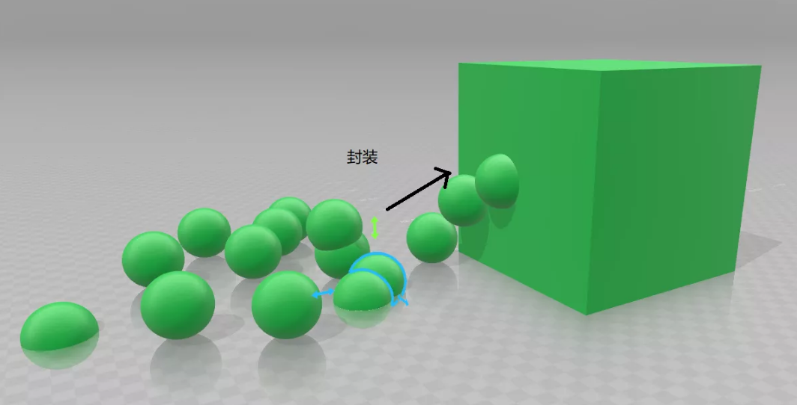

## 十三：Java封装



### 什么是Java封装
在真实的世界中， 我们有个伟大的概念，叫做**抽象**，抽象是现代世界最伟大的发明。抽象是指人们在使用某一产品的时候，只需要依据使用手册了解如何操作产品，而不需要学习产品的原理和相关产品的实现细节。比如，要使用吹风机，我们只需要知道将吹风机插上电源，打开开关，而不需要去了解关于电动机，风叶，电热元件等的工作原理。抽象将如何使用和如何实现的分离成了两个部分，对于普通人，我们只需要知道如何使用部分， 不用去关心如何实现的部分。

Java是一门面向对象的编程语言，在Java中，抽象使得团队合作成为了可能，在一个比较大项目中，不同的模块由不同的成员编写，每位成员只负责自己模块中功能的实现，在自己模块内编写每一行代码。成员之间可以依据接口定义来相互调用别人模块的接口，在调用别人代码的时候我们只关心如何引用别人代码的接口，不会关心别人代码的内部是如何实现的，每一行代码是如何遍写的，它的代码分了几个代码块，用了几个循环语句等实现细节。

在面向对象的编程语言中，我们给这种代码的抽象赋予了一个新的名字-**封装(Encapsulation)**。封装或信息隐藏是面向对象语言的特征之一，它被认为是一个保护屏障，防止类的状态和行为被随意访问。有了封装，我们可以精确控制对象类的属性和方法的访问级别，隐藏那些不希望被外界访问的属性。也可以控制外界访问类的属性的方式，如只让外界通过类的方法来对属性的值进行修改，避免了外界直接访问类属性存在的潜在风险，使得我们的代码和数据更加安全可控。

### 访问控制
在Java中，封装的实现是通过修改属性的可见性来限制对属性的访问，Java中控制属性可见性的关键字有**public**和**private**。

在本节之前的内容中，我们使用的属性都是public的，换句话说，这些属性都是公开可见的，在客户类中可以通过`对象.属性`来修改对象属性的值。如果我们要隐藏对象的某些属性，使得这些属性只能在本类内可见，类外不可见，我就可以定义private属性，示例代码如下：
```java
public class Person{
  private String name;
  private int age;
}
```
以上实例中，我们将Person类的**name**和**age**属性设置为private，那么这两个属性就只能在Person类内部被使用，在Person类之外是没有办法访问这两个属性的。在客户类中，我们定义一个Person对象`Person perA = new Person();`，试图使用以下代码来修改对象的name和age是无法通过编译的。
```java
perA.name = "Ada";   //name是private的，在客户类中不可以直接使用**对象.属性**来访问这个属性
perA.age = 18;  //age是private的，在客户类中不可以直接使用**对象.属性**来访问这个属性
```
那么，是不是类中的private属性就没有办法被访问和使用了，回答是否定的，首先，private属性可以在本类内部被访问，其次，如果需要在类之外访问某一个private的属性，那么我们一般会提供一个public的属性访问器，public的属性访问器是一个方法，在方法中，我们可以加入对属性有效值的验证等代码。属性访问器的命名，一般为动名词，如**setXXX**和**getXXX**，以name属性的访问器为例，我们会定义2个访问器方法：
```java
public int getName()
{
  return name;
}

public void setName(String name)
{
  this.name = name;
}
```
在客户类中，我们可以调用getXXX属性访问器来获取属性的值，调用setXXX属性访问器来设置属性的值：
```java
Person perA = new Person();
perA.setName("Ada");
System.out.println("对象perA的name: "+perA.getName());
```
### private方法
有时候，我们在类中写的某一个方法，只想让本类中的其他方法使用，不希望它在类外被访问，有人会问有这种情况吗？回答是肯定的，在实际项目中，肯定有这种情况。这种情况常见于帮助(helper)方法，为了减少代码冗余，我们会把很多方法中公共的代码拿出来，做成一个类内部的公共方法，让类中的其他方法引用这个类内的公共方法来减少代码冗余。这样做既可以减少代码的行数，又可以保证在一个地方维护同一一段代码，保持代码一致性，提高代码可维护性。

private方法的定义和普通方法无异，差别只是将方法的可见性由public修改为private。
```java
private returnType MethodName()
{
}
```
如果你还是不理解为什么需要private方法，我们来举个例子，比如写系统日志文件的代码，在一个类中，我们需要写日志的方法可能有很多处，为了有一个统一的命名规范，日志文件的名字可以依据系统时间来生成。
```java
    private String getLogName()
    {
        Date dtNow = new Date();
        SimpleDateFormat ft = new SimpleDateFormat("yyyy-MM-dd-hh-mm-ss");
        return ft.format(dtNow)+".txt";
    }
```
以上getLogName方法只在这个类内部被使用，在类外不可见。

### private构造函数
同private方法一样，类的构造函数也可以声明为private的，这样子的类的构造函数只能被本类使用，在客户类中，不可以使用private的构造函数来定义对象。我们来看看在**[类的构造方法](https://www.jianshu.com/p/898d6bbea8eb?utm_campaign=maleskine&utm_content=note&utm_medium=reader_share&utm_source=qzone)** 章节的示例代码，如果我们不想让客户设置年龄，那么我们可以将第一个构造方法设置为private，示例代码如下：
```java
    private Person(String name, int age)
    {
        this.name = name;
        this.age  = age;
    }

    public Person(String name)
    {
        this(name,0);
    }

    public Person()
    {
        this("");
    }
```
### 访问private元素
声明为private的属性和方法，只能在本类内被访问，在类外是不能访问的。注意的是，在类内，可以访问其他同类对象的私有变量，举例来说，如果person类的name是private的，如果有个方法判断两个人同名，则可以使用`对象.name`来访问private的name，示例代码如下：
```java
public Person{
  private String name;
  ...
    public boolean sameName(Person other)
    {
        return this.name==other.name;
    }
```

### 示例代码
Person类的示例代码可以从GitHub上下载，[Person代码](https://github.com/7788wangzi/IntroJava/blob/master/Person.java)。
