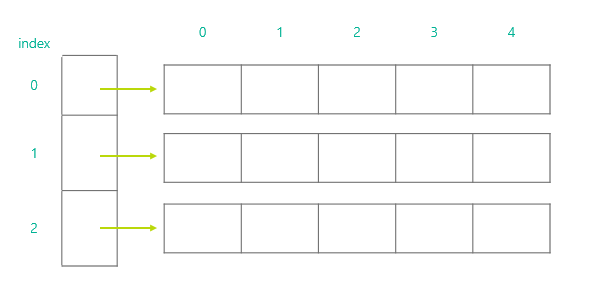
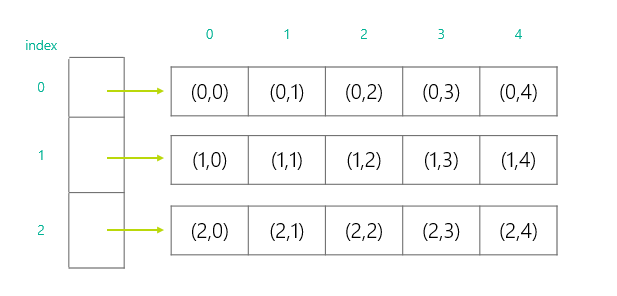
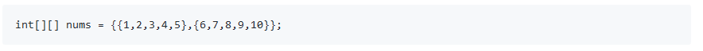

## 六：二维数组

数组是由一系列相同数据类型的元素组成的序列，如果数组中每一个元素本身又是一个数组，这样子的数组就称为二维数组。二维数组的声明语法如下：
```java
datatype[][] 2dArrayName = new datatype[numOfArrays][capacityOfEachArray];
```
+ numOfArrays: 二维数组有多少个数组元素，即数组的行数
+ capacityOfEachArray: 每一个数组元素的数组长度，即数组的列数

一般，二维数组可以用下图来形象地表示：  
  
从以上示意图可以看出，这是一个3行5列的表格，我们使用如下语句来定义这样子的一个二维数组：
```java
int[][] nums = new int[3][5];
```

同样地，我们可以使用数组索引直接存取二维数组中的元素，需要注意的是，同数组一样，二维数组的每一个维度起始索引值都为0。我们通过`nums[0][0] = 5;`给二维数组中的第一行第一列元素赋值。 这样子的一个二维数组它每一个元素的索引值可以参考下表：  
  

也可以在创建二维数组的同时给每一个元素赋值，参考如下语句：




通过以上语句，我们创建了一个2行5列的二维数组，并用数值初始化了数组的每一个元素。

### 二维数组的循环
当需要遍历二维数组中的每一个元素的时候，我们需要用到2层循环，外层循环来遍历二维数组的行，内层循环来遍历二维数组的列，遍历一个二维数组可以使用如下语句：
```java
int[][] nums = new int[3][5];
for(int row = 0; row < nums.length; row++)
{
    for(int col = 0; col < nums[row].length; col++)
    {
        System.out.print(nums[row][col]+" ");
    }
    System.out.println();
}
```
程序输出结果如下：
0 0 0 0 0
0 0 0 0 0
0 0 0 0 0

### 练习
请使用2层循环的方式来创建一个二维数组：
1 2 3 4 5
6 7 8 9 10

