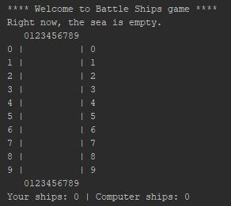
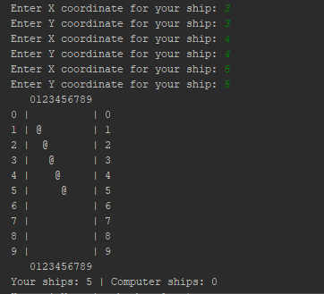
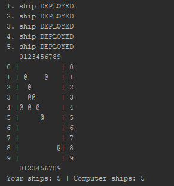
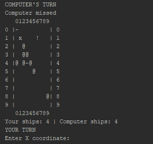
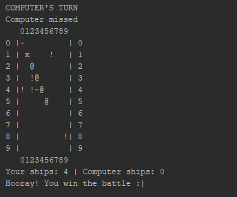

## 八--实战1-Battle-Ships
### 概述
今天，我们来重新定义Battle Ships游戏，我们通过这个游戏来练习我们第三节到第七节课所学到的关于数组的相关知识。首先，我们定义一个游戏棋盘，这个棋盘是一个10 x 10的二维数组。在游戏棋盘中，作为玩家，可以通过指定x, y的索引来部署自己的战船，玩家一共部署5艘玩家战船。作为玩家的对手，计算机在游戏棋盘中随机部署5艘计算机战船。玩家和计算机轮流攻击棋盘中的战船，玩家通过输入x, y的索引来确定攻击的位置，计算机通过随机生成x, y坐标值来确定攻击位置。

### Step 1: 输出游戏棋盘
Battle Ships的游戏棋盘是由10 X 10的二维数组组成的，你需要定义一个输出棋盘的方法，该方法负责：
+ 输出玩家战船和计算机战船的位置
+ 记录玩家所剩战船的数量，记录计算机所剩战船的数量

在游戏刚开始时，玩家战船为0，计算机战船为0， 此时输出空白棋盘，如下图所示：  


### Step 2: 部署玩家战船
玩家一共需要部署**5艘**玩家战船，程序循环提示玩家直到玩家成功部署5艘战船。每次，玩家通过输入战船的x, y坐标值来部署一艘战船，玩家部署战船的规则如下：
+ 在同一个位置(x, y 相同），只能部署一艘战船
+ 玩家只能将战船部署在棋盘中，不可以部署到棋盘以外，即(x>=0 & x<=9)和(y>=0 & y<=9)，如果玩家输入的值不满足这个条件，则要求玩家重新输入x或y的值。

每次玩家成功地部署一艘玩家战船，将二维数组该位置的值设为**1**，标识这是一个玩家战船。
**注意**：要接收从控制台输入的信息，可以使用Java中的`java.util.Scanner`
```java
import java.util.Scanner;

public class BattleShipGame {

    public static void main(String[] arg){
        int[][] myArrayMap = new int[10][10];

        Scanner input = new Scanner(System.in);
...
...
        System.out.print("Enter X coordinate for your ship: ");
        int x = input.nextInt();
...
...
}
}
```
当5艘玩家战船部署完成， 需要打印出当前游戏棋盘中战船的位置，在有玩家战船的位置，输出@，这时输出结果如下：  


### Step 3: 部署计算机战船
计算机战船一共*5艘*，需要由程序随机确定计算机战船的位置，部署计算机战船的规则如下：
+ 计算机战船不可以部署在已经有玩家战船或其他计算机战船的位置上
+ 计算机战船不可以部署在游戏棋盘之外

**注意**: 计算机随机生成(x, y)的值，用到了Java中的`java.util.Random`，示例代码如下：
```java
Random rand = new Random();
int csX = rand.nextInt(10);
int csY = rand.nextInt(10);
```

每当计算机成功部署一艘战船，将二维数组该位置的值设为**2**，标识这是一条计算机战船，并打印一条信息到控制台，待所有战船部署完成，在有计算机战船的位置，同样输出@，这时输出结果如下：  


### Step 4: 攻击
玩家和计算机轮流攻击棋盘中的战船， 并记录每一次攻击的情况。
**玩家**：玩家通过输入(x, y)坐标值来确定一个攻击位置
1. 若玩家输入的位置不合法，则继续让玩家重新输入新的攻击位置
2. 若玩家成功猜中一个计算机战船位置，则输出"嘣，你成功击毁一艘敌方战船。"，在输出棋盘时，此位置输出**!**来替代**@**
3. 若玩家错误地攻击自己的战船，则输出"天哪！你击毁了一艘自己的战船。"，在输出棋盘时，此位置输出**x**来替代**@**
4. 若玩家没有攻任何击到战船，则输出"对不起，攻击无效。"，在输出棋盘时，此位置输出**-**

**计算机**: 计算机通过随机生成一个(x, y)坐标值来确定一个攻击位置
1. 若随机生成的(x,y)不合法，则重新生成(x, y)坐标值，不合法的规则如下
   + 若超出棋盘范围，则不合法
   + 若已经猜过该位置，则不合法
2. 若计算机成功猜中一个玩家战船的位置，则输出"计算机干掉了一艘玩家战船"，在输出棋盘时，此位置输出**x**来替代**@**
3. 若计算机猜中一个计算机战船的位置，则输出"计算机错误地干掉了一艘计算机战船"，在输出棋盘时，此位置输出**!**来替代**@**
4. 若计算机没有攻击到任何战船，则输出"计算机攻击无效。"。

经过几轮攻击以后，打印结果如下：  


### Step 5: 游戏结束
定义游戏结束规则：
+ 当计算机剩余战船数量为0， 则玩家胜
+ 当玩家剩余战船数量为0，则计算机胜
  


对输出符号的注释：
+ "@"标识此处有战船，玩家战船或计算机战船
+ "x"标识此处一艘玩家战船被击毁
+ "!"标识此处一艘计算机战船被击毁
+ "-"标识玩家没有猜中

### 附录
关于该项目的示例代码，可以从GitHub中下载[Project - BattleShip](https://github.com/7788wangzi/IntroJava/tree/master/Project%20-%20BattleShip)
