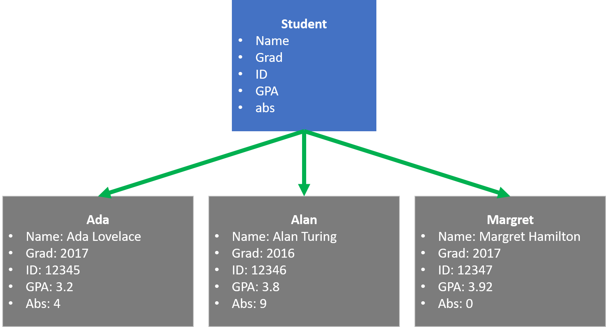

## 九：认识Java对象

### 对象和类
面向对象编程的核心是**对象**， 如何来理解对象和类的概念是很重要的。Java中的对象并不是生活中找对象的那个对象，面向对象的编程相对应的是面向过程的编程。面向过程，是从解决问题的角度看待问题，需要解决什么问题就写什么程序，写出来的程序都带有特定的功能，这些功能松散地分布在各处，他们之间没有任何联系。面向对象则从关系的视角看世界，以事物的内在与外在的联系来处理问题，将事物分类，并赋予不同事物类不一样的**状态**和**行为**。举例来说，世界上有2类人，男人(boy)和女人(girl)，这是两个类，而我们每个人就是某一个类的实例对象。男人的状态有身高，体重，年龄，等。男人的行为有打猎，种地，开车，等。女人的状态有身高，体重，年龄，发型颜色，等。女人的行为有购物，穿高跟鞋，生小孩，等。  


### 对象的好处
有时候我们通过简单的变量是不足以或不方便描述一件事情的，比如，我们要记录学校中学生的信息，那么我们就要定义很多组变量，每个学生要有一组变量来描述这个学生，有些变量描述学生名字，有些变量描述学生年级等。如果我们把每个学生都看成是一个对象，那么学生的姓名和成绩自然就是这个对象的内部属性了。对比一下不同， 如果使用变量来描述三个学生信息，则程序代码如下所示：

```java
        // 以下使用一组变量来描述学生信息
        String stu1Name = "Ada Lovelace";   //姓名
        int stu1Grad = 2017;    //年级
        int stu1ID = 12345;     //学号
        double stu1GPA = 3.2;   //绩点
        int stu1Abs = 4;    //缺席次数

        String stu2Name = "Alan Turing";
        int stu2Grad = 2016;
        int stu2ID = 12346;
        double stu2GPA = 3.8;
        int stu2Abs = 9;

        String stu3Name = "Margret Hamilton";
        int stu3Grad = 2017;
        int stu3ID = 12347;
        double stu3GPA = 3.92;
        int stu3Abs = 0;
```
同样表示三个学生信息，使用对象的程序代码如下：
```java
        // 使用对象
        Student ada = new Student("Ada Lovelace", 2017, 12345, 3.2, 4);
        Student alan = new Student("Alan Turing", 2016, 12346, 3.8, 9);
        Student margret = new Student("Margret Hamilton", 2017, 12347, 3.92, 0);
```
从对比代码中可以看出，使用对象让我们的程序代码更加模块化，代码更加简洁，程序可读性，程序可理解性也更好。

### 对象的定义
我们要自己定义一个对象，首先要定义一个类，类的信息包括类的名称，类的属性，类的方法。在以上的程序代码中，我们用到了Student对象，那么它的类的定义如下：
```java
public class Student {
    String name;
    int grad;
    int ID;
    double GPA;
    int abs;

    public Student(String name, int grad, int ID, double GPA, int abs) {
        this.name = name;
        this.grad = grad;
        this.ID = ID;
        this.GPA = GPA;
        this.abs = abs;
    }

    public boolean isGraduating() {
        return (GPA > 2.0 && abs < 10 && grad == 12);
    }
}
```
对象是具体化的类，类是抽象化的对象，以上三个学生对象和Student类的关系，可以用以下图表示：  

**类**
+ 类有一个特定的名称
+ 类中定义了本类所有的属性
+ 类中定义了本类所有的方法
+ 在一个Java程序中，可以有多个类的定义

**对象(实例)**
+ 对象是一个类的具体化的个体
+ 定义对象的时候要使用new关键字
+ 程序运行过程中，可以定义同一个类的很多对象的副本
